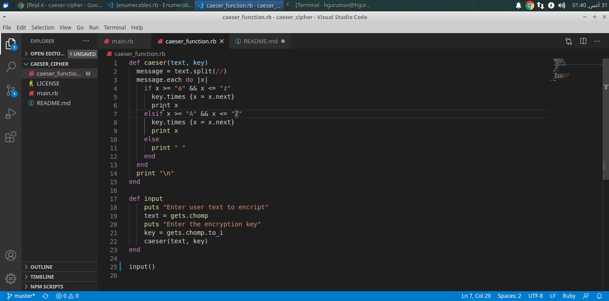

# caeser_cipher
Caeser Cipher from the Odin Project

> In this project, we implemented the Caeser Cipher. 
A user enter a text and an encryption key, the program then encrpts the text based on the key given.
 
#Caeser Cipher

## Screenshot

## Built With

- VsCode
- Ruby
- Rubocop

## Live Demo

[Live Demo Link](https://repl.it/@happiguru/caeser-cipher#caeser_function.rb)

### Prerequisites

- Browser (Google Chrome, Mozilla Firefox, Safari or any other browser)

### Setup

- Download or clone the repository's files [Repo Link](https://github.com/happiguru/caeser_cipher/tree/master)

## Authors

👤 **Stanley Enow Lekunze**

- Github: [@happiguru](https://github.com/happiguru)
- Twitter: [@Lekunze_Nley](https://twitter.com/Lekunze_Nley)
- Linkedin: [lekunze-nley](https://www.linkedin.com/in/lekunze-nley/)

## 🤝 Contributing

Contributions, issues and feature requests are welcome!

Feel free to check the [issues page](https://github.com/happiguru/caeser_cipher/issues).

## Show your support

Give a ⭐️ if you like this project!

## Acknowledgments

- Microverse
- GitHub
- TheOdinProject
- Ruby

## 📝 License

This project is [MIT](lic.url) licensed.

